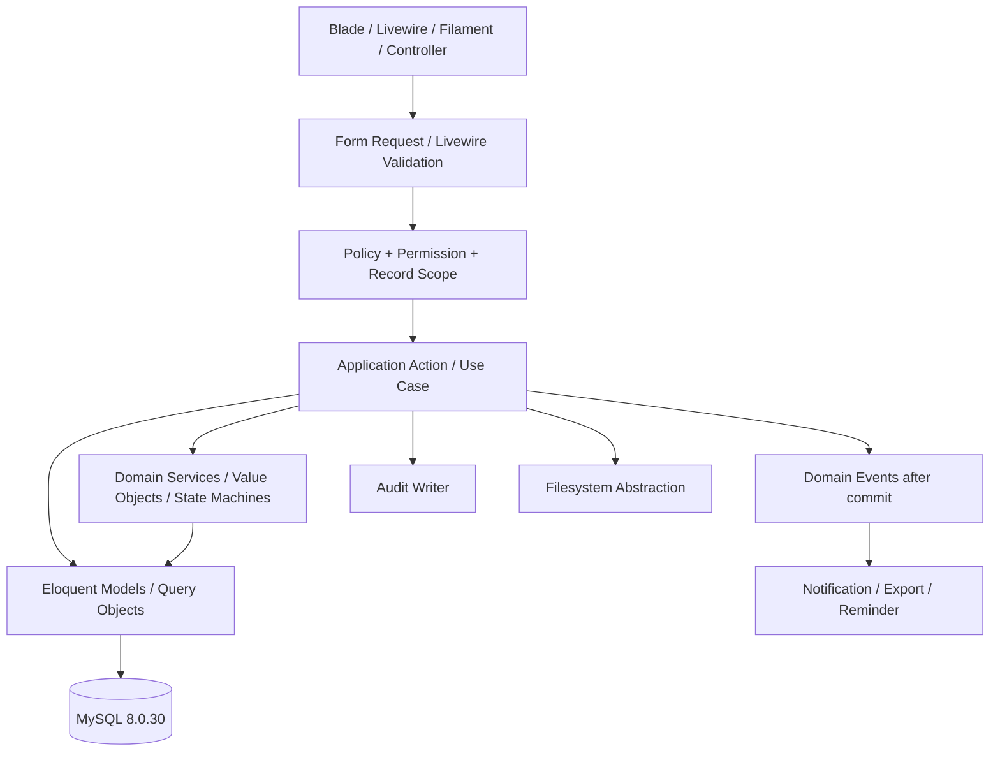
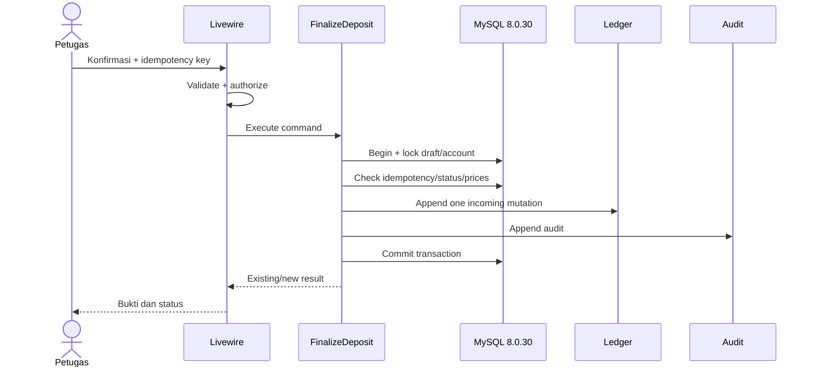

# Arsitektur Sistem

## 1. Sasaran

Sistem dibangun sebagai modular monolith Laravel yang aman untuk Hostinger shared hosting, mudah dipelihara oleh tim kecil, dan menjaga transaksi serta ledger secara atomik. Arsitektur ini mencakup seluruh baseline; urutan implementasi tidak membagi ruang lingkup.

## 2. Stack terkunci

| Lapisan | Teknologi/keputusan |
|---|---|
| Runtime | PHP 8.5 untuk web dan CLI |
| Framework | Laravel 13 |
| UI warga/petugas/publik | Blade + Livewire 4, komponen khusus |
| Interaksi ringan | Alpine.js bawaan Livewire; tidak dimuat kedua kali |
| Styling | Tailwind CSS 4.1+ |
| Back-office | Filament 5 dengan custom theme; hanya admin/back-office |
| Database | MySQL 8.0.30 melalui Laragon |
| Test | Pest 4 |
| Build aset | Vite/Tailwind di lokal atau CI |
| Hosting | Hostinger Web Hosting Premium/Business, hPanel, SSH/SFTP, Composer 2, cron |
| Queue | `sync` atau `database` yang diproses berkala dan berbatas waktu melalui cron |
| Zona waktu | `Asia/Jakarta` |

React tidak digunakan. Tidak ada Redis, Horizon, Supervisor, WebSocket, worker permanen, akses root, atau konfigurasi Nginx sendiri.

## 3. Konteks sistem

```mermaid
flowchart LR
    Public[Publik] --> Web[UI Publik Blade/Livewire]
    Citizen[Warga] --> CitizenUI[UI Warga Blade/Livewire]
    Officer[Petugas/Bendahara] --> OfficerUI[UI Petugas Blade/Livewire]
    Admin[Admin/Superadmin] --> Panel[Filament Back-office]
    Web --> App[Laravel Modular Monolith]
    CitizenUI --> App
    OfficerUI --> App
    Panel --> App
    App --> DB[(MySQL 8.0.30)]
    App --> Private[(Storage Privat)]
    App --> PublicFiles[(Aset Publik Terkontrol)]
    App --> WA[wa.me: dibuka manual]
    Cron[Hostinger Cron] --> Scheduler[Laravel Scheduler]
    Scheduler --> App
    Backup[Backup Terpisah] <-- DB
    Backup <-- Private
```

WhatsApp bukan integrasi pengiriman. Aplikasi hanya membentuk tautan dan membuka klien pengguna.

## 4. Modular monolith

### 4.1 Modul bisnis

| Modul | Tanggung jawab | Tidak boleh dilakukan |
|---|---|---|
| IdentityAccess | Autentikasi, sesi, verifikasi, role, permission, policy. | Menulis ledger atau memutuskan transaksi. |
| CustomersRegions | Profil nasabah, nomor/kartu/QR, wilayah, area pelayanan, layanan berbantuan. | Menaruh data pribadi dalam QR. |
| WastePricing | Kategori, jenis, satuan, kondisi, edukasi, periode harga. | Mengubah snapshot transaksi lama. |
| Deposits | Draf/final setoran, detail, bukti, koreksi, reversal, QR bukti. | Mengedit transaksi final langsung. |
| Ledger | Rekening, mutasi masuk/keluar/penyesuaian, hold, saldo tersedia. | Menyimpan saldo sebagai angka bebas edit. |
| Pickups | Pengajuan, foto, kapasitas, alternatif tanggal, penugasan, status. | Menggunakan perkiraan sebagai nilai saldo. |
| Withdrawals | Pengajuan, approve, pay, kedaluwarsa, bukti. | Menggabungkan approve dan pay sebagai satu permission. |
| Groceries | Paket deskriptif, approve, prepare, handover, bukti. | Mengelola stok rinci. |
| Programs | Target, layanan keliling, partisipasi wilayah, statistik publik. | Mengelola produksi paving block. |
| Communications | Notifikasi, pengingat, pengumuman, template `wa.me`. | Menyatakan WhatsApp terkirim otomatis. |
| Reporting | Laporan web/XLSX dan file ekspor privat. | Melewati scope record. |
| AuditReconciliation | Audit append-oriented dan insiden operasional. | Menghapus audit lewat fungsi operasional. |
| Platform | Media, setting, scheduler, queue terbatas, health, backup log, PWA. | Memerlukan layanan daemon shared hosting. |

### 4.2 Struktur kode yang disarankan

```text
app/
  Domain/
    IdentityAccess/
    CustomersRegions/
    WastePricing/
    Deposits/
    Ledger/
    Pickups/
    Withdrawals/
    Groceries/
    Programs/
    Communications/
    Reporting/
    AuditReconciliation/
    Platform/
      Actions/
      Data/
      Enums/
      Events/
      Models/
      Policies/
      Queries/
      Rules/
      Services/
  Filament/
  Livewire/
    Citizen/
    Officer/
    PublicSite/
  Http/
    Controllers/
    Middleware/
resources/
  views/
    components/
    layouts/
    livewire/
```

Struktur aktual dapat menyesuaikan konvensi Laravel 13, tetapi boundary modul, dependency direction, dan kontrak domain harus dipertahankan. Model tidak menjadi tempat seluruh orkestrasi. Aksi/use case mengoordinasikan transaction, policy, lock, event, dan audit.

## 5. Lapisan dan dependency



Aturan dependency:

1. UI tidak menulis model finansial secara langsung.
2. Livewire action tipis: authorize, validate, panggil application action, tangani hasil typed.
3. Application action adalah boundary transaction untuk use case kritis.
4. Domain service/value object mengimplementasikan uang, berat, status, pembulatan, dan transisi.
5. Query object menangani filter/agregasi kompleks dan selalu menerima scope izin.
6. Side effect nonkritis dijalankan setelah commit; side effect yang menentukan konsistensi disimpan di transaction yang sama.
7. Modul tidak membaca tabel internal modul lain secara bebas untuk menulis; gunakan action/service/event yang disepakati.

## 6. Pola use case kritis

### Finalisasi setoran



Kegagalan sebelum commit me-rollback seluruh perubahan. Event notifikasi dikirim setelah commit dan tidak menggandakan ledger.

### Hold menjadi saldo keluar

1. Lock pengajuan, rekening, dan hold aktif.
2. Verifikasi status, permission tindakan, assignment, bukti, dan idempotency key.
3. Append mutasi keluar dengan unique source.
4. Ubah hold `aktif` menjadi `dikonversi`.
5. Ubah pengajuan menjadi selesai/dibayar.
6. Simpan audit.
7. Commit; kemudian kirim notifikasi.

Penolakan/batal/kedaluwarsa mengikuti action berbeda yang hanya melepas hold.

## 7. Data dan transaction

- MySQL 8.0.30 memakai InnoDB, foreign key, unique index, composite index, dan check constraint.
- Rupiah berupa `BIGINT`; berat `DECIMAL(p,3)`; nilai domain tidak memakai `FLOAT/DOUBLE`.
- Status direpresentasikan PHP backed enum/value object dan kolom string terbatas/check atau lookup sesuai keputusan migrasi.
- Waktu disimpan konsisten dan dikonversi ke `Asia/Jakarta` pada boundary tampilan/bisnis.
- Operasi ledger memakai `DB::transaction`, row-level lock (`SELECT … FOR UPDATE` melalui Eloquent/query builder), dan unique constraint sumber.
- Idempotency record menyimpan key, actor/scope, payload hash, status, dan result reference.
- Audit aksi finansial masuk transaction yang sama.
- Read model/dashboard boleh memakai query agregat/cache pendek, tetapi bukan sumber kebenaran.

Rincian berada di [DATA_MODEL.md](DATA_MODEL.md).

## 8. Antarmuka aplikasi

### Publik

Blade/Livewire untuk beranda, harga, edukasi, jadwal, target/statistik agregat, pengumuman, dan verifikasi QR. Endpoint publik memiliki allowlist data, rate limit, dan cache terpisah.

### Warga

Shell khusus mobile-first, saldo-first, maksimal lima bottom navigation item. Bukan Filament. Semua detail dipolicy ke record sendiri.

### Petugas/bendahara

Shell khusus task-first untuk smartphone lapangan, scan/nomor, setoran, pickup, pay/handover, layanan keliling, warga berbantuan, dan laporan sesuai assignment. Bukan Filament.

### Admin/superadmin

Filament 5 untuk back-office data-dense dan action-first. Resource/action tetap memanggil application action dan policy yang sama; Filament bukan bypass domain. Tema memakai token [DESIGN.md](DESIGN.md).

## 9. Livewire dan Alpine

1. Livewire 4 menjadi mekanisme interaksi server utama.
2. Alpine.js hanya instance yang disediakan Livewire; tidak ada import CDN/bundle kedua.
3. State finansial tidak dipercaya dari property browser; server mengambil ulang harga, saldo, status, dan permission.
4. Tombol kritis memakai loading/disabled untuk UX, tetapi idempotensi tetap di server.
5. Upload sementara dibatasi dan dipindahkan ke storage privat hanya setelah validasi.
6. Komponen besar dipecah berdasarkan use case, bukan satu komponen untuk seluruh dashboard.

## 10. File dan media

- `public/` hanya memuat front controller dan aset build/publik yang aman.
- Bukti transaksi, foto pickup, bukti pembayaran/penyerahan, ekspor, backup, dan sumber tidak berada pada disk publik.
- Database menyimpan disk, path/key acak, MIME, ukuran, checksum, owner/reference, visibility, dan timestamp; bukan blob.
- Akses privat melalui controller/route terotorisasi atau signed temporary URL.
- Image derivative publik dibuat tanpa metadata sensitif.
- Backup berada di lokasi terpisah dari akun hosting utama sejauh infrastruktur memungkinkan.

## 11. Queue, scheduler, dan cron

### Mode awal

- Default aman: `QUEUE_CONNECTION=sync` untuk pekerjaan ringan.
- `database` queue boleh dipakai bagi ekspor/notifikasi yang dapat ditunda, hanya jika cron dapat menjalankan worker **berbatas waktu** dan mekanisme retry/monitoring tersedia.
- Tidak menjalankan `queue:work` permanen, Horizon, Supervisor, daemon, Redis, atau WebSocket.

### Scheduler

Satu cron Hostinger memanggil scheduler pada interval yang didukung. Scheduler mengatur:

- kedaluwarsa pencairan/sembako dan pelepasan hold;
- pengingat jadwal/perubahan;
- pemrosesan batch database queue terbatas;
- pembersihan upload/file ekspor sementara;
- pemeriksaan backup dan health yang relevan.

Setiap task menggunakan mutex/without-overlapping yang kompatibel, batas waktu, logging tersanitasi, dan idempotensi. Timezone cron Hostinger diverifikasi; bila cron berjalan UTC, jadwal eksplisit dikonversi agar waktu bisnis tetap `Asia/Jakarta`.

## 12. PWA terbatas

Service worker memakai strategi allowlist:

| Sumber | Strategi |
|---|---|
| Aset versioned Vite/font/icon lokal | Cache-first dengan versioning |
| Halaman informasi umum yang disetujui | Network-first dengan fallback cache terbatas |
| Auth, profil, saldo, transaksi, pengajuan, notifikasi | Network-only; tidak dicache |
| POST/PUT/PATCH/DELETE/Livewire update | Network-only; tidak diantrekan offline |
| File privat/signed URL | Network-only |

Manifest menyediakan instalasi. Offline tidak berarti transaksi offline.

## 13. Integrasi eksternal

| Integrasi | Kontrak |
|---|---|
| WhatsApp | URL `https://wa.me/<nomor>?text=<encoded>`; pengguna mengirim manual; tidak ada webhook/status kirim. |
| MySQL 8.0.30 | TLS bila tersedia/diwajibkan, least-privilege credential, koneksi dari aplikasi hosting. |
| Object storage kompatibel S3 | Opsional jika dipilih; credential melalui environment; private bucket; signed URL. |
| Email | Driver yang tersedia pada hosting untuk notifikasi yang disetujui; tidak digunakan untuk reset kata sandi atau pengiriman token; failure tidak membocorkan akun; queue sesuai batas. |

Tidak ada API produksi paving block, timbangan digital, payment gateway, atau layanan WhatsApp gateway dalam baseline.

## 14. Observability

- Log terstruktur dengan correlation/request ID, level, module, action, result, dan actor ID bila aman.
- Password, cookie, token, secret, isi file, identitas lengkap, dan payload finansial sensitif tidak dicatat.
- Audit log bisnis terpisah dari application log.
- Health check privat memeriksa aplikasi, database, storage, scheduler heartbeat, queue backlog bila dipakai, dan backup recency tanpa membuka detail publik.
- Error pengguna memakai incident/reference ID; detail berada pada log.
- Kapasitas shared hosting dipantau melalui hPanel, ukuran storage, error rate, waktu respons, slow query yang tersedia, dan cron result.

## 15. Keamanan dan performa

Kontrol lengkap di [SECURITY.md](SECURITY.md). Prinsip arsitektur:

- Laravel query builder/Eloquent binding, output escaping Blade, CSRF, secure session, rate limit.
- Policy pada setiap record dan action, termasuk Livewire/Filament/export/file.
- Pagination dan eager loading terukur; hindari N+1.
- Index mengikuti filter/status/waktu/wilayah/sumber.
- Upload dikompresi/diturunkan ukuran; tidak memproses file besar tanpa batas.
- Statistik publik memakai query agregat/cache yang tidak mencampur data privat.

## 16. Deployment topology

```text
Hostinger account
├── application source (di luar document root bila struktur hosting memungkinkan)
│   ├── app, bootstrap, config, database, resources, routes
│   ├── vendor
│   ├── storage (private)
│   └── .env (private, permission ketat)
└── document root domain → application/public
    ├── index.php
    ├── build/ (hasil Vite lokal/CI)
    └── aset publik aman
```

Jika hPanel tidak mendukung pemilihan document root secara langsung, gunakan mekanisme deployment Hostinger yang tetap membuat domain hanya menyajikan isi `public/`; jangan menyalin seluruh proyek ke direktori publik. Detail perintah dan rollback berada di [DEPLOYMENT.md](DEPLOYMENT.md).

## 17. Quality gates

1. Format/static analysis sesuai konfigurasi proyek.
2. Pest unit/feature SQLite `:memory:` lulus sebagai gate engineering harian normatif; browser/E2E kritis lulus sebelum rilis.
3. Migration dan perilaku production-engine diuji pada rehearsal MySQL 8.0.30 disposable yang tercatat sebelum UAT/production; ini release-validation, bukan blocker harian per-IMP, dan hasil SQLite tidak membuktikan MySQL production.
4. Build Vite selesai di lokal/CI dan manifest tersedia.
5. Pemeriksaan permission, idempotensi, ledger, file privat, dan statistik publik lulus.
6. PHP web dan CLI sama-sama terverifikasi 8.5.
7. Scheduler/cron dan zona waktu diverifikasi pascadeploy.
8. Backup tersedia sebelum migrasi dan rollback telah ditentukan.

## 18. Keputusan dan perubahan

Keputusan utama dicatat pada [DECISIONS.md](DECISIONS.md). Perubahan boundary modul, stack, hosting, ledger, storage, PWA, atau integrasi memerlukan ADR/change request dan pembaruan seluruh kontrak terkait.
