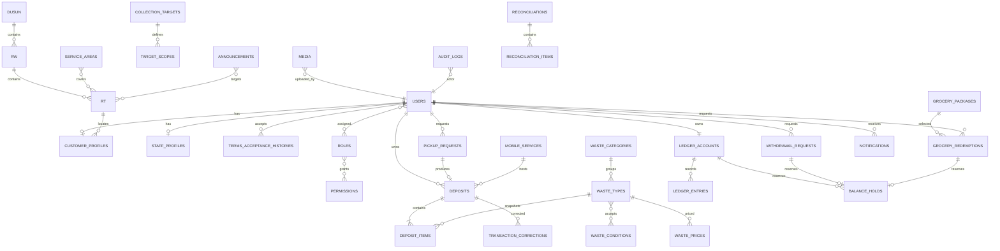

# Model Data

## 1. Prinsip

MariaDB/InnoDB menjadi sumber data transaksional. ID internal memakai `BIGINT UNSIGNED` atau ULID secara konsisten. Rupiah memakai `BIGINT`; berat memakai `DECIMAL(15,3)` dan tidak pernah `FLOAT`. File disimpan pada storage, bukan blob database. Semua status memakai PHP backed enum/value object dan constraint yang kompatibel. Waktu bisnis ditampilkan dalam `Asia/Jakarta`.

Kebijakan penghapusan: data finansial, audit, status, bukti, dan rekonsiliasi tidak dihapus operasional; master bereferensi dinonaktifkan atau soft-delete; pivot yang tidak memiliki histori boleh cascade; FK histori umumnya `RESTRICT`, sedangkan pelaku yang dinonaktifkan tetap dipertahankan.

## 2. ERD inti

## 3. Identitas dan akses

| Tabel | Kolom penting | Indeks/constraint | Penghapusan |
|---|---|---|---|
| `users` | `id`, `name VARCHAR(120)`, `phone VARCHAR(20)`, `password VARCHAR(255)`, `status VARCHAR(32)`, `terms_version`, `terms_accepted_at`, `verified_at`, `last_login_at`, timestamps | UQ `phone`; IDX `status` | Nonaktif/soft-delete; RESTRICT bila bereferensi |
| `terms_acceptance_histories` | `id`, `user_id`, `accepted_version`, `accepted_at` (waktu server), timestamps | FK `user_id`; UQ `(user_id, accepted_version)`; IDX `user_id, accepted_at`; append-only | RESTRICT bersama histori pengguna; retensi mengikuti kebutuhan operasional/hukum yang disetujui |
| `customer_profiles` | `user_id`, `customer_number VARCHAR(40)`, `rt_id`, `address VARCHAR(500)`, `joined_at`, `qr_token_hash CHAR(64)`, `qr_rotated_at` | PK/FK `user_id`; UQ nomor dan token; IDX `rt_id` | RESTRICT |
| `staff_profiles` | `user_id`, `staff_number`, `service_area_id`, `active_from/to` | UQ nomor; IDX area/status | RESTRICT |
| `roles`, `permissions` | `id`, `name`, `description` | UQ `name` | RESTRICT bila dipakai |
| `role_user`, `permission_role` | FK terkait, timestamps, pemberi/alasan assignment | UQ pasangan; FK cascade untuk pivot | Cascade pivot |
| `sessions` | session identifier, user, IP ringkas, timestamps | IDX user | Purge sesuai retensi |

Perubahan kata sandi berbantuan direkam pada `audit_logs`: aktor, target, metode verifikasi `tatap_muka` atau `callback_nomor_terdaftar`, alasan 10–1000 karakter, dan hasil. Perubahan mandiri direkam pada `audit_logs`: aktor yang sama dengan target, metode `mandiri_profil`, alasan sistem `perubahan_mandiri`, dan hasil. Audit tidak menyimpan kata sandi atau secret. Tidak ada tabel atau data lifecycle token reset, token sementara, maupun kanal pengiriman password/token.

## 4. Wilayah dan master sampah

| Tabel | Kolom penting | Indeks/constraint | Penghapusan |
|---|---|---|---|
| `dusun`, `rw`, `rt` | `id`, parent FK, `code`, `name`, `is_active` | UQ `(parent_id,code)`; IDX aktif | Nonaktif; RESTRICT |
| `service_areas` | `id`, `name`, `is_active`, batas default kapasitas | UQ nama | Nonaktif |
| `service_area_rt` | area/RT | UQ pasangan | Cascade pivot |
| `waste_categories` | kode, nama, urutan, aktif | UQ kode | Nonaktif |
| `waste_units` | kode, nama, simbol, klasifikasi satuan, faktor konversi ke `kg` hanya untuk satuan berat fisik bila ditetapkan | UQ kode | RESTRICT |
| `waste_conditions` | kode, nama, deskripsi, urutan, aktif | UQ kode | Nonaktif |
| `waste_types` | kategori/satuan FK, kode, nama, deskripsi edukasi, `is_plastic`, media FK, aktif | UQ kode; IDX kategori/aktif/plastik | Nonaktif |
| `waste_type_conditions` | jenis/kondisi FK | PK atau UQ pasangan; FK cascade untuk pivot tanpa histori | Cascade pivot |
| `waste_prices` | jenis dan kondisi FK, `price BIGINT`, `effective_from`, `effective_to`, pembuat | IDX `(waste_type_id,waste_condition_id,effective_from,effective_to)`; constraint tidak tumpang tindih per jenis+kondisi ditegakkan service+lock | Immutable; tutup periode |

`kg` adalah satuan kanonik untuk berat. Satuan berat fisik dapat dikonversi untuk presentasi atau input ke `kg` bila faktor konversinya ditetapkan. Satuan non-berat tidak dikonversi otomatis ke atau dari satuan lain. Harga selalu berscope tepat pada pasangan jenis sampah dan kondisi.

## 5. Setoran, snapshot, dan QR bukti

| Tabel | Kolom penting | Indeks/constraint | Penghapusan |
|---|---|---|---|
| `deposits` | nomor, customer/staff FK, metode enum, pickup/mobile FK nullable, lokasi/waktu, status, total berat `DECIMAL(15,3)`, total nilai `BIGINT`, `finalized_at`, `idempotency_id`, `verification_token_hash` | UQ nomor, idempotency, token; IDX customer/date, staff/date, status/date | Draf dapat dibersihkan; final RESTRICT |
| `deposit_items` | deposit/jenis FK, snapshot kode/nama/satuan/kondisi, berat `DECIMAL(15,3)`, harga `BIGINT`, subtotal `BIGINT`, rounding_version | UQ logis bila item digabung; IDX jenis | RESTRICT |
| `transaction_corrections` | deposit FK, nomor, alasan, before/after JSON aman, delta nilai/berat, pembuat, approved/finalized time, media FK | UQ nomor; IDX deposit/date | Append-only |
| `transaction_reversals` | original deposit/entry, nomor, alasan, actor, time | UQ original per reversal penuh; UQ nomor | Append-only |
| `idempotency_keys` | key, actor, scope, payload hash, status, result type/id, expiry | UQ `(actor_id,scope,key)`; IDX expiry | Purge setelah retensi aman |

Snapshot pada `deposit_items` wajib berdiri sendiri dari master. Perubahan `waste_prices` atau nama jenis tidak mengubah transaksi lama.

## 6. Ledger saldo

| Tabel | Kolom penting | Indeks/constraint | Penghapusan |
|---|---|---|---|
| `ledger_accounts` | user FK, status, currency=`IDR` | UQ user; IDX status | RESTRICT |
| `ledger_entries` | nomor, account FK, `direction` masuk/keluar, `kind`, `amount BIGINT`, source type/id, related entry, effective/created time, balance_after opsional | UQ nomor; UQ `(source_type,source_id,kind)`; IDX account/effective, source | Append-only |
| `balance_holds` | nomor, account FK, source type/id, `amount BIGINT`, status aktif/dikonversi/dilepas, held/released/converted time | UQ nomor; UQ `(source_type,source_id)`; IDX account/status | Append-only status transition |

Saldo tersedia dihitung dari agregat ledger masuk dikurangi keluar dan hold aktif. Jika `balance_after` disimpan, nilainya adalah bukti rekonsiliasi di bawah lock, bukan saldo bebas edit.

## 7. Penjemputan, pencairan, dan sembako

| Tabel | Kolom penting | Indeks/constraint | Penghapusan |
|---|---|---|---|
| `pickup_requests` | nomor, customer, area/RT, alamat, tanggal pilihan/jadwal, perkiraan berat `DECIMAL(15,3)`, status, alasan, assigned staff, deposit FK | UQ nomor; IDX date/status/area, customer/date | RESTRICT |
| `pickup_items` | request, waste type, perkiraan jumlah/berat | IDX request/type | RESTRICT |
| `pickup_capacities` | date, area, batas alamat/berat, staff/vehicle label opsional, status | UQ `(date,area_id)`; IDX date | Simpan histori |
| `status_histories` | domain type/id, old/new status, actor, reason, time | IDX object/time | Append-only |
| `withdrawal_requests` | nomor, customer, amount `BIGINT`, status, hold FK, approver, payer, approved/expires/paid time, rejection reason, proof media | UQ nomor/hold; IDX status/date, payer/status | RESTRICT |
| `grocery_packages` | kode, nama, isi, value `BIGINT`, active period, media, status | UQ kode; IDX status/period | Nonaktif |
| `grocery_redemptions` | nomor, customer/package, value snapshot `BIGINT`, status, hold, approver, handover actor, expires/completed time, proof | UQ nomor/hold; IDX status/date | RESTRICT |

Tidak ada tabel stok rinci, mutasi stok, gudang, atau kuantitas inventori sembako.

## 8. Program dan informasi

| Tabel | Kolom penting | Indeks/constraint | Penghapusan |
|---|---|---|---|
| `mobile_services` | nomor, RT/RW, titik, start/end, status, capacity, notes | UQ nomor; IDX region/start/status | Simpan histori |
| `mobile_service_staff`, `mobile_service_waste_types` | jadwal dengan petugas/jenis | UQ pasangan | Cascade pivot sebelum histori terkunci |
| `collection_targets` | nomor, nama, tujuan, start/end, target weight `DECIMAL(15,3)`, status, public flag | UQ nomor; IDX status/period | Simpan histori |
| `target_scopes` | target, jenis/kategori/wilayah nullable terkontrol | IDX target dan dimensi | RESTRICT |
| `announcements` | judul, isi tersanitasi, audiens, publish start/end, status, author | IDX status/period/audience | Soft-delete setelah retensi |
| `announcement_rt` | announcement/RT | UQ pasangan | Cascade pivot |
| `notifications` | recipient, type/template, title/body aman, reference, read_at, scheduled_at, dedupe key | UQ dedupe key; IDX recipient/read/date | Retensi terjadwal |

Statistik partisipasi dan publik adalah query/read model agregat dari transaksi final bersih; materialized summary opsional harus dapat dibangun ulang.

## 9. Media, laporan, audit, dan operasi

| Tabel | Kolom penting | Indeks/constraint | Penghapusan |
|---|---|---|---|
| `media` | UUID, disk, path acak, original name, MIME, size, checksum, visibility, uploader, attachable type/id | UQ UUID/path; IDX attachable | Hapus hanya sesuai retensi dan referensi |
| `report_exports` | requester, type, filters JSON, format, status, media, expires, error reference | IDX requester/status/date, expiry | File purge; metadata sesuai retensi |
| `audit_logs` | event UUID, actor, action, auditable type/id, old/new JSON tersanitasi, IP hash/ringkas, user agent ringkas, correlation ID, time | UQ UUID; IDX object/time, actor/time, action/time | Append-only; retensi teknis |
| `reconciliations` | business date, status, opening/closing totals, cash total, difference, notes, creator, approver, version | UQ `(business_date,version)`; IDX status/date | Append-only revisions |
| `reconciliation_items` | reconciliation, type, reference, expected/actual/difference `BIGINT`, status/note | IDX reconciliation/type | RESTRICT |
| `backup_logs` | started/finished, operator key nullable untuk kompatibilitas row lama, request payload hash nullable, type, location alias, checksum, status, size, restore_tested_at, error reference | UQ `(initiated_by,operator_key)` (nilai nullable historis tidak dipakai); IDX status/date | Retensi teknis |
| `settings` | key, typed value encrypted bila sensitif, group, updated_by | UQ key | Audit perubahan |

Secret utama tetap di environment, bukan `settings` atau audit.

## 10. Enum/value object wajib

| Domain | Nilai minimum |
|---|---|
| Akun | `menunggu_verifikasi`, `aktif`, `ditolak`, `nonaktif` |
| Setoran | `draf`, `final`, `dikoreksi`, `dibalik` |
| Hold | `aktif`, `dikonversi`, `dilepas` |
| Penjemputan | `menunggu_pemeriksaan`, `diterima`, `dijadwalkan`, `menuju_lokasi`, `dijemput`, `selesai`, `ditolak`, `dibatalkan` |
| Pencairan | `menunggu_verifikasi`, `disetujui`, `siap_diambil`, `sudah_dibayar`, `ditolak`, `dibatalkan`, `kedaluwarsa` |
| Sembako | `menunggu_verifikasi`, `disetujui`, `sedang_disiapkan`, `siap_diambil`, `selesai`, `ditolak`, `dibatalkan`, `kedaluwarsa` |
| Layanan keliling | `draf`, `dipublikasikan`, `dibuka`, `ditutup`, `dibatalkan` |
| Target | `draf`, `aktif`, `ditutup`, `dibatalkan` |
| Export/backup | `menunggu`, `diproses`, `berhasil`, `gagal`, `kedaluwarsa` sesuai domain |

Transisi mengikuti [BUSINESS_RULES.md](BUSINESS_RULES.md), bukan update string bebas.

## 11. Strategi indeks dan integritas

- Indeks komposit mengikuti query: `(customer_id, created_at)`, `(status, scheduled_date)`, `(rt_id, finalized_at)`, `(account_id, effective_at)`.
- FK wajib untuk semua referensi internal; polymorphic source dibatasi katalog type dan diuji integritasnya melalui service serta reconciliation.
- UQ idempotensi, nomor bisnis, token hash, dan source ledger adalah kontrol wajib.
- Migration besar menghindari lock panjang shared hosting: tambah nullable, backfill terbatas, verifikasi, lalu constraint.
- JSON hanya untuk snapshot/audit/filter yang tidak menjadi relasi utama; data yang perlu difilter dan dijaga integritasnya menjadi kolom/tabel.

## 12. Data privat dan retensi

Klasifikasi dan retensi rinci mengikuti [SECURITY.md](SECURITY.md) serta [OPERATIONS.md](OPERATIONS.md). Data pribadi diminimalkan; ekspor dan bukti privat; QR hanya token acak. Backup mencakup database dan media serta diuji restore. Tidak ada model data produksi paving block.
